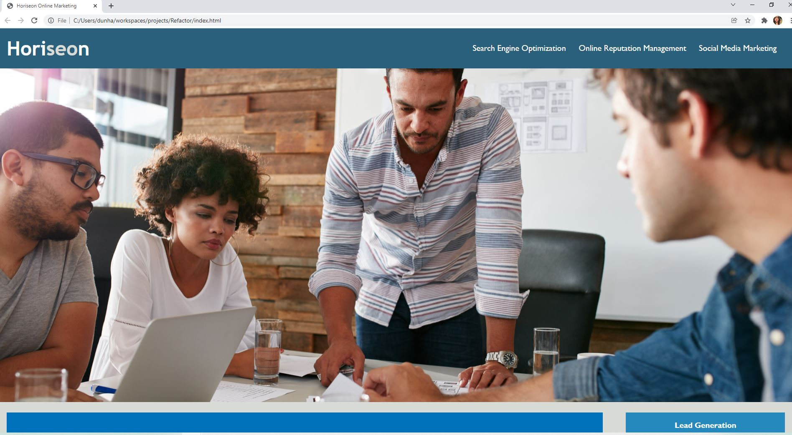

# refactor
Horiseon Refactor Website

The goals of this project for Horiseon Marketing are listed below:

- better accessibility standards
- cleaning up redundant code
- ensuring all links are functioning properly
- the selectors are organized in a semantic structure
- the CSS is properly commented
- the page loads without issue
- the repo contains the application code
- it resembles thee mock up by at least 90%
- there are multiple texted commits on GitHub
- there is a simple README file

CSS was used for adding padding, fonts, color, margins, and aligning text. In the future I am interested in implementing voice to text and adding video visuals. 

The trouble I had was with the git commits. Scott helped me and it seemed to process, but it's not showing as an update in the repo. I committed again after meeting with him the next day. I also thought that adding it to GitHub was submitting the project, but Scott informed me it was in Bootcamp Spot and I submitted it there.

